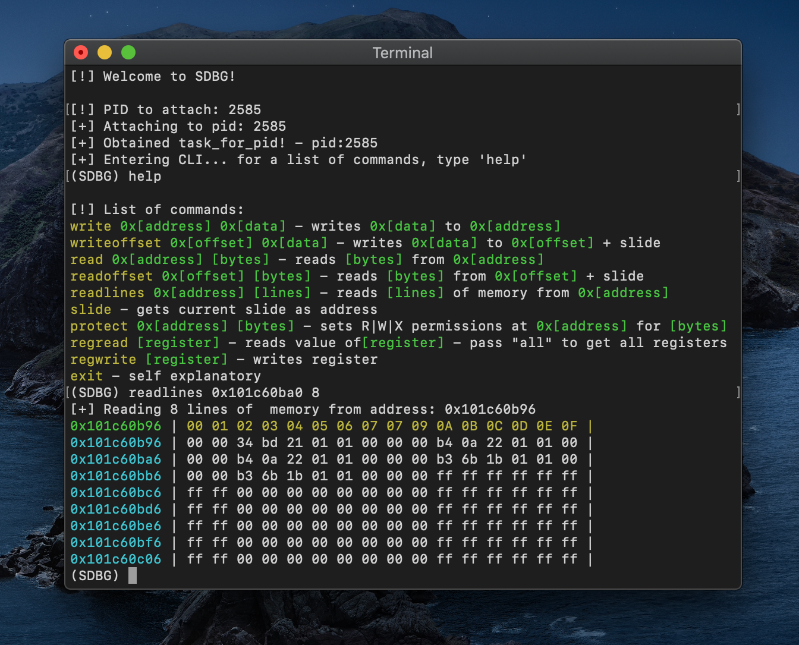

# sdbg - scuffed debugger for iOS

Features:
- Write memory (write)
- Write to offset (writeoffset)
- Read memory (read)
- Read memory of offset (readoffset)
- Read lines from memory (readlines)
- Set memory region permissions (protect)
- Get current memory slide (slide)
- And more coming...

Make sure to sign sdbg with ent.xml! SDBG can't operate without proper entitlements.

